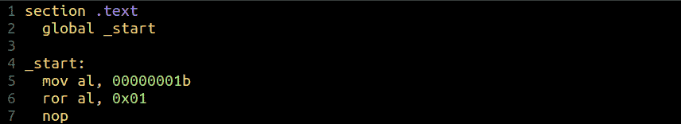
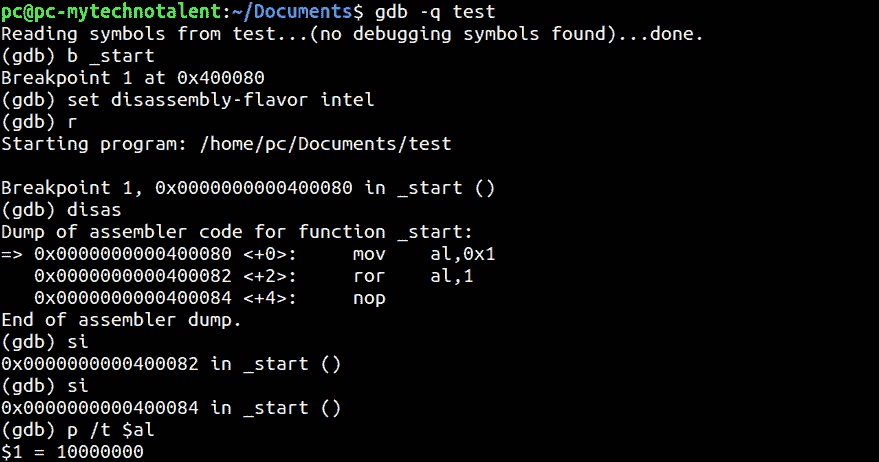

# 第 17 部分-error 语句

> 原文：<https://0xinfection.github.io/reversing/pages/part-17-ror-instruction.html>

如需所有课程的完整目录，请点击下方，因为除了课程涵盖的主题之外，它还会为您提供每个课程的简介。[https://github . com/mytechnotalent/逆向工程-教程](https://github.com/mytechnotalent/Reverse-Engineering-Tutorial)

ROR 命令代表向右旋转。

在上面 Ubuntu Linux 机器上的简单 x64 示例中，我们看到我们将 1 移动到 al 中并向右旋转 1 位。

二进制表示为 **00000001b** 。如果我们 **ROR** 1 bit，这个值就变成了 **10000000b** ，如下所示。

我们首先通过以下方式编译和链接:

**nasm-f elf 64-o test . o test . ASM**

**ld -o 测试 test.o**

我们可以在调试器中看到，al 从 1 开始，当我们向右旋转时，它转到 **10000000b** 。

下周我们将深入了解引导扇区基础知识！敬请期待！