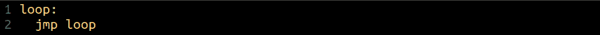
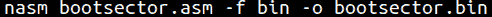
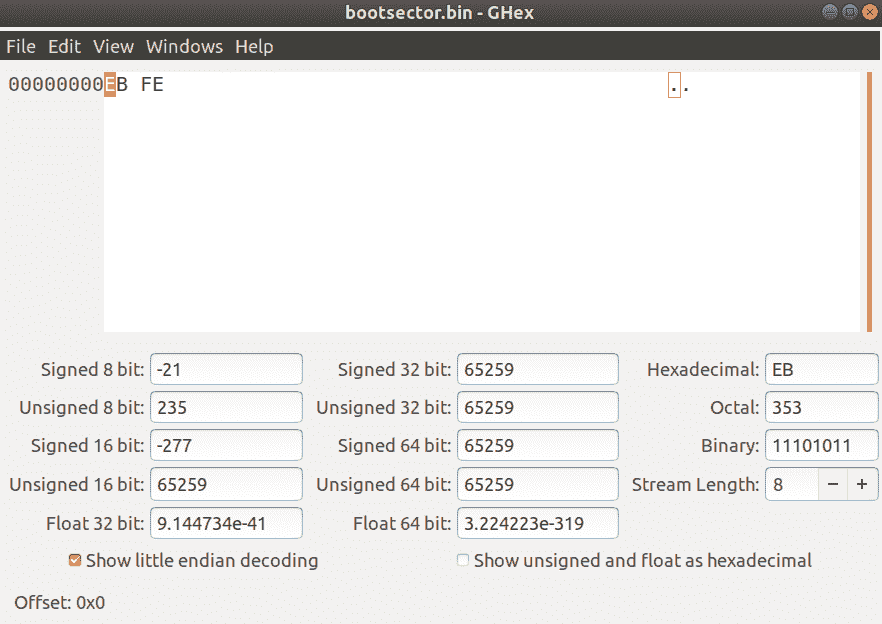

# 第 19 部分-引导扇区基础知识[第 2 部分]

> 原文：<https://0xinfection.github.io/reversing/pages/part-19-boot-sector-basics-part-2.html>

如需所有课程的完整目录，请点击下方，因为除了课程涵盖的主题之外，它还会为您提供每个课程的简介。[https://github . com/mytechnotalent/逆向工程-教程](https://github.com/mytechnotalent/Reverse-Engineering-Tutorial)

我们正处于开始集成真实世界代码的阶段。如果你没有 linux 桌面，我建议你在你的 Windows 或者 Mac 上安装 Virtualbox 和 Ubuntu。我有一个先前的教程，将带你通过这个过程如下。由于某种原因，我不能嵌入链接，所以请复制并粘贴到您的浏览器。

**[https://www . LinkedIn . com/pulse/assembly-language-basic-malware-逆向工程-kevin-m-thomas-16/](https://www.linkedin.com/pulse/assembly-language-basic-malware-reverse-engineering-kevin-m-thomas-16/)**

您还需要一个用于终端的文本编辑器。我使用 VIM。你可以在下面找到一个设置链接。

**[https://www . LinkedIn . com/pulse/assembly-language-basic-malware-逆向工程-kevin-m-thomas-17/](https://www.linkedin.com/pulse/assembly-language-basic-malware-reverse-engineering-kevin-m-thomas-17/)**

此外，您必须安装 nasm，因此您只需键入:

**sudo apt-get 安装 nasm**

NASM 是我们将使用的汇编程序，我们将专注于英特尔语法。首先进入终端，启动 Vim 并键入以下内容:

请记住键入“I”进行插入，然后键入“esc”和“wq”进入命令模式并保存文件。

上面一行只是设置了一个无限循环，仅此而已。创建了**循环**标签，我们只需将 **jmp** 返回给它自己。这段代码本身可以编译，但是它不能在操作系统中运行，因为它不会触发我们所说的“幻数”, BIOS 会将这个幻数理解为引导扇区的结束。我们将在以后的讲座中详细介绍这一点。

我们输入上面的命令，假设您在 vim 中将文件保存为 **bootsector.asm** 。这将创建一个二进制文件，我们将在一个十六进制编辑器中检查其中的内容。十六进制编辑器是一个应用程序，它检查编译到文件中的每个字节的数据。我们将会看到，上面的汇编指令最终会被翻译成它们的原始操作码值。处理器只理解简单操作码的原始操作码。下面是识别操作码的表格的链接。我帮您省去参考英特尔数据集的麻烦，因为它实际上有数千页和几卷:

**[http://ref . x86 ASM . net/coder 64 . html](http://ref.x86asm.net/coder64.html)**

让我们使用像 ghex 这样的十六进制编辑器，打开我们的 bin 文件。

我们看到 **EB FE** 是十六进制字节，每个字母是一个半字节(一个半字节是 4 位或半个字节)。两个 **EB FE** 组成两个完整的字节。请记住，处理器以相反的字节顺序从磁盘中读取数据，即先读取 **FE** ，然后读取 **EB** 。这个过程被称为小端，这就是 x64 处理器的工作方式。

如果你查看我提供链接的表格，你会看到 **FE** 代表一个 **INC** 或递增 1。这是我们的循环值。

接下来你会发现 **EB** 代表 **JMP** 也就是我们上面的跳转指令。

如果你是装配新手，这是大量的信息。一步一步来，在真正的 linux 操作系统中跟随我，每一课你都会对基础有更好的理解。

下周，我们将在这节课的基础上向二进制文件中添加一些简单的数据。