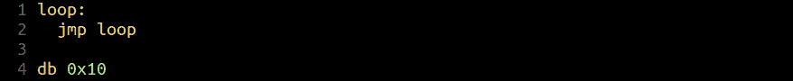
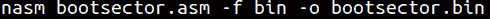
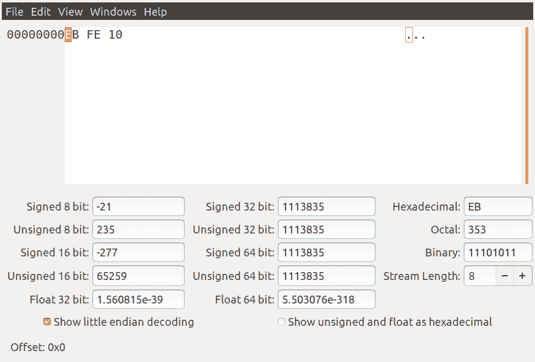

# 第 20 部分-引导扇区基础知识[第 3 部分]

> 原文：<https://0xinfection.github.io/reversing/pages/part-20-boot-sector-basics-part-3.html>

如需所有课程的完整目录，请点击下方，因为除了课程涵盖的主题之外，它还会为您提供每个课程的简介。[https://github . com/mytechnotalent/逆向工程-教程](https://github.com/mytechnotalent/Reverse-Engineering-Tutorial)

对于那些熟悉组装的人来说，接下来的几周/几个月可能看起来我们进展非常缓慢，但是我们的目标是帮助那些对硬件了解不多的人更好地了解为云提供动力的系统。

绝大多数 AWS 和 Azure 以及许多其他云服务都使用基于 x64 的操作系统。了解这些系统启动时会发生什么具有重要的价值，这就是为什么我们要在机器加载时，通过一个非常缓慢的过程来查看启动扇区的每一部分。

让我们检查一下我们的源代码。跟随 Vim 或 Nano。

上周我们学习了第 1 行和第 2 行的操作码，我们不必复习。今天，我们在代码中添加一个字节的数据。请注意，这是一个十六进制数，将与我们的二进制数相匹配。在以后的课程中，我们将会看到十进制和其他系统是什么样子。

我们来编译一下。如果您没有安装 NASM，请确保您键入 **sudo apt-get install nasm** 。

让我们看看十六进制编辑器中的二进制文件。我使用 GHex 是因为我坚持 GNU 的传统，因为我们将在未来的课程中使用名为 GDB 的 GNU 调试器。这些都在你的 Linux 系统上，因为我用 Ubuntu 做这些教程。

上周我们看到 **EB** 和 **FE** 对应我们的 **INC** 和 **JMP** 指令。如果不清楚，请重读上周的课。我们将第 3 个字节视为 **10** 。记住这是十六进制的，所以十进制的值应该是 **16** 。

下周，我们将继续在我们的操作系统开发系列中添加代码和进展。