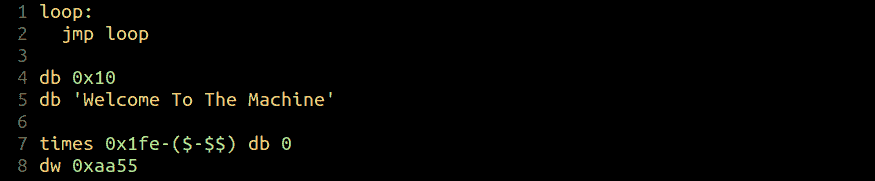
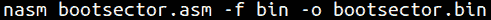
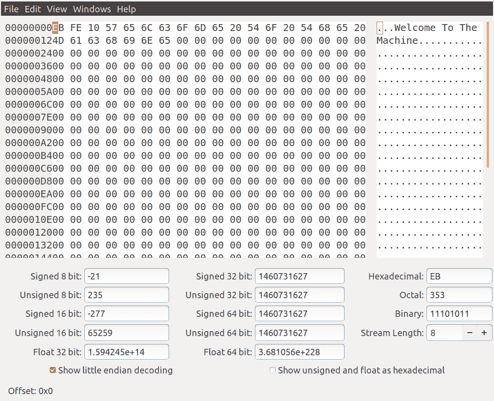
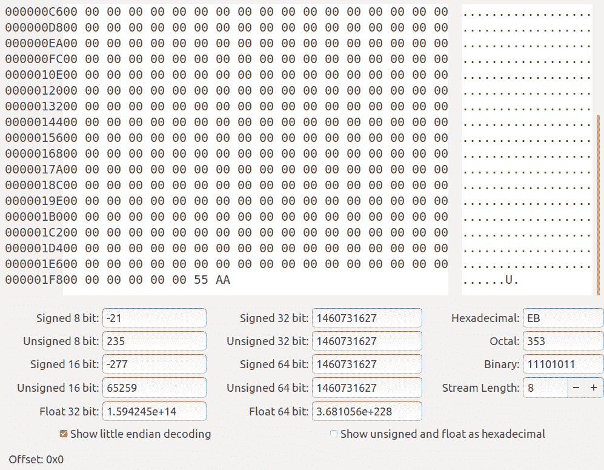

# 第 22 部分-引导扇区基础知识[第 5 部分]

> 原文：<https://0xinfection.github.io/reversing/pages/part-22-boot-sector-basics-part-5.html>

如需所有课程的完整目录，请点击下方，因为除了课程涵盖的主题之外，它还会为您提供每个课程的简介。[https://github . com/mytechnotalent/逆向工程-教程](https://github.com/mytechnotalent/Reverse-Engineering-Tutorial)

我们从查看代码的一些简单添加开始。我们今天要做的是创建一个简单的操作系统，它除了启动什么也不做。我们将使用 QEMU 作为模拟器，因为我懒得设置 VirtualBox 或 VMWare，不过你可以很容易地移植。bin 到 an。iso，如果你选择从其中一个启动。

我们只是在第 7 行添加了一个填充算法，它只是检查在减去 200h 或 512 之后还剩多少字节，然后用零填充剩余的字节。最后，您将看到我们称之为幻数的数字 **0xaa55** ，因为这是 cpu 正在寻找的用于识别引导扇区的签名。请记住，这段代码在引导时位于扇区 0，因为没有文件系统，所以如果它找到成功的签名，它将尝试引导它。

我们用上面的代码构建二进制文件。现在让我们看看十六进制编辑器中的代码。

正如你所看到的，正如我们所预期的，它用 0 填充了剩余的字节，直到 200h 或 512。下面是二进制的余数。

正如你在最后看到的，我们有 55 AA。我们记得我们的处理器是小端的，所以当我们编码时，它是 **aa 55** ，这是它的映射格式。当它进入 cpu 时，它颠倒了字节顺序。你明白这一点很重要。

下周，我们除了发布新的操作系统之外，什么也不做。敬请关注。