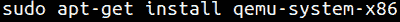
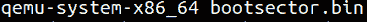
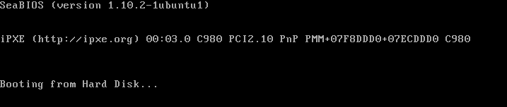

# 第 23 部分-引导扇区基础知识[第 6 部分]

> 原文:[https://0x infection . github . io/reversing/pages/part-23-boot-sector-basics-part-6 . html](https://0xinfection.github.io/reversing/pages/part-23-boot-sector-basics-part-6.html)

如需所有课程的完整目录，请点击下方，因为除了课程涵盖的主题之外，它还会为您提供每个课程的简介。[https://github . com/mytechnotalent/逆向工程-教程](https://github.com/mytechnotalent/Reverse-Engineering-Tutorial)

本周我们将关注如何使用 QEMU，它是一个模拟器来引导我们简单的新操作系统。

键入以上内容以获取专门针对 x86 系统的 qemu。

用我们的二进制文件运行模拟器。

您将看到以下内容。请记住，它除了无限循环跳转之外什么也不做，这一点我们在前面的课程中已经详细讨论过了。然而，这是人们可以创建的最基本的 x86 操作系统。

它只是寻找我们上周提到的签名(如果这没有意义，请复习上周的课程),如果它正好是 200h 字节，并且被放置在引导介质的第一个扇区，则该过程将成功。

如果您感兴趣，不同的架构有不同的仿真器。

下周我们将讨论内存寻址，这样我们可以在简单的操作系统中建立一个堆栈。