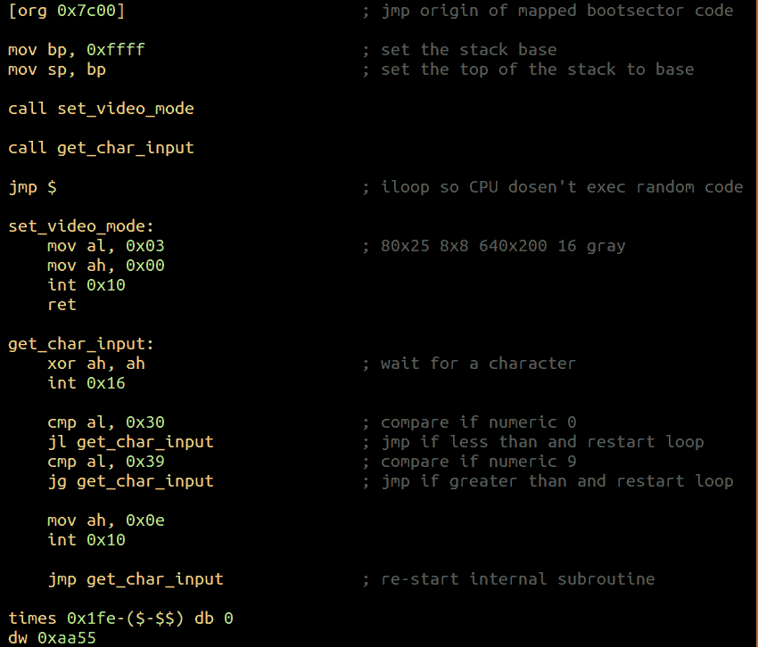
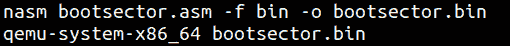

# 第 25 部分-引导扇区基础知识[第 8 部分]

> 原文:[https://0x infection . github . io/reversing/pages/part-25-boot-sector-basics-part-8 . html](https://0xinfection.github.io/reversing/pages/part-25-boot-sector-basics-part-8.html)

如需所有课程的完整目录，请点击下方，因为除了课程涵盖的主题之外，它还会为您提供每个课程的简介。[https://github . com/mytechnotalent/逆向工程-教程](https://github.com/mytechnotalent/Reverse-Engineering-Tutorial)

今天我们将把所有的碎片放在一起。我们将创建我们的自定义操作系统，除了启动什么也不做，设置一个视频模式，然后只接受控制台中的数字。这是这个引导扇区基础迷你系列的最后一个教程。

让我们检查一下我们的代码:

我们要做的第一件事是移动到引导扇区代码的可编程区域，地址为 0x7c00。然后，我们设置堆栈基址，确定堆栈的区域，并将基址指针设置为堆栈指针。

然后我们调用我们的视频模式函数，在这里我们设置一个 640x200 灰度控制台。然后我们调用 get 字符输入函数，该函数只允许数字 0 到 9，正如您所看到的，0x30 是 0 的十六进制 ascii 值，而 0x39 是 9 的十六进制 ascii 值。如果用户在控制台中键入任何其他内容，实际上不会有任何内容进入控制台。这是你在装配中的绝对控制权。

让我们编译并运行:

然后我们会看到 qemu 控制台:

如你所见，我只能在我们的操作系统中输入数字。你自己试试。编写代码，在 qemu 编辑器中编译并运行。如果您还没有安装 qemu，我将在最后两个教程中向您详细展示如何安装它。

花点时间认真回顾一下我在这里做的事情，因为理解这是您的计算机在进入 32 位和 64 位模式之前启动的方式是至关重要的。

下周我们将简单讨论你的计算机如何连接 64 位操作系统的高级概念。