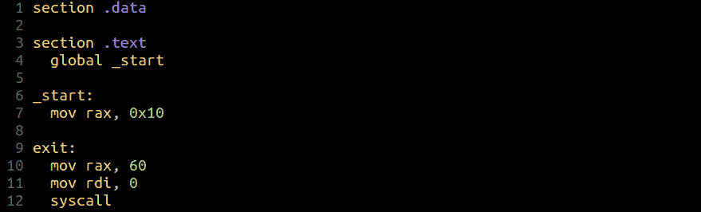
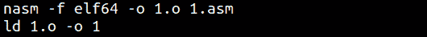
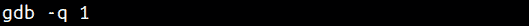
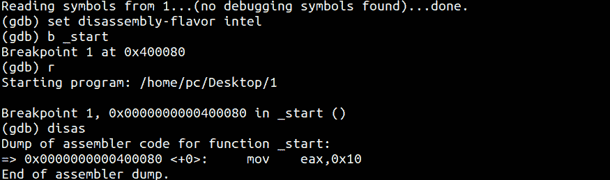
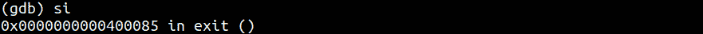
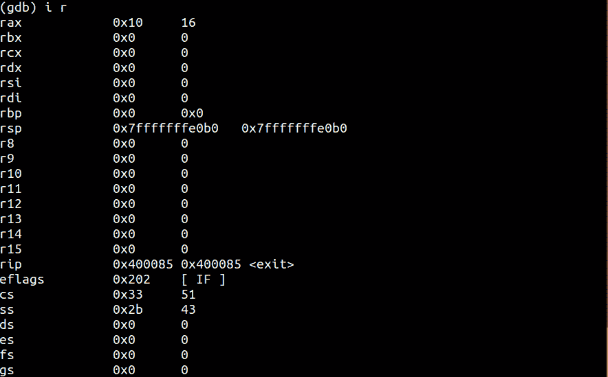

# 第 27 部分- x64 组件[第 1 部分]

> 原文:[https://0x infection . github . io/reversing/pages/part-27-x64-assembly-part-1 . html](https://0xinfection.github.io/reversing/pages/part-27-x64-assembly-part-1.html)

如需所有课程的完整目录，请点击下方，因为除了课程涵盖的主题之外，它还会为您提供每个课程的简介。[https://github . com/mytechnotalent/逆向工程-教程](https://github.com/mytechnotalent/Reverse-Engineering-Tutorial)

今天，我们开始实际的 x64 代码基础。在接下来的几周里，我将创建一些非常简单的例子，以便我们能够掌握 x64 架构。让我们从一个基本代码块开始:

我们从声明**开始。data** 部分，我们所有的全局数据都存储在这里。如果我们有一个字符串或其他形式的硬编码数据，它将进入该块。在我们的例子中，我们将让它为空。

**。文本**部分声明程序的入口点将从哪里开始，在我们的例子中我们使用 **_start** 或者您可以使用 **main** 。

我们只需将十进制 16 或十六进制 10 的值移入 64 位 RAX 寄存器。我们马上会看到，当我们在 GDB 调试时，处理器将只使用较低的 EAX。

最后一部分只是一个简单的退出例程，我们将 60 移动到 RAX，然后进行 syscall。它只是将操作返回给操作系统。

我们来编译链接一下:

让我们在 GDB 调试:

让我们为英特尔语法设置调试器，并在开始时设置一个断点:

正如我们所看到的，十进制 16 或十六进制 10 即将被移入 EAX，但正如我们所看到的，它尚未完成，直到我们向前迈进。

现在我们可以查看我们的寄存器。

我们可以看到，RAX 成功地持有十进制 16 或十六进制 10。

我们将花几周时间来研究这些简单的例子，这样您就可以熟悉处理器的工作方式及其内部工作方式。