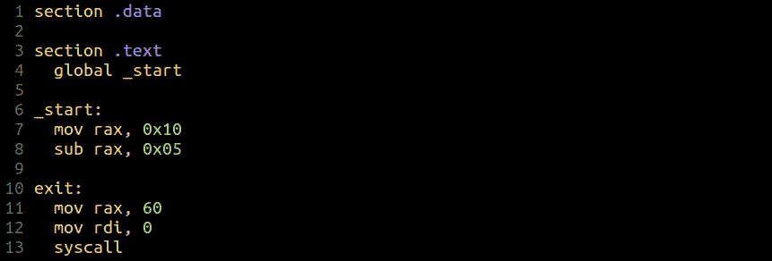
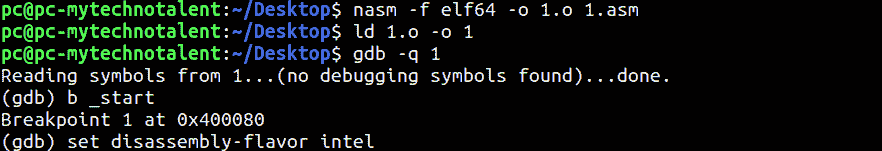
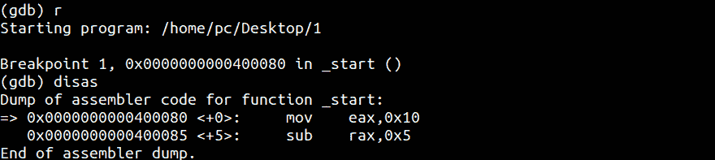
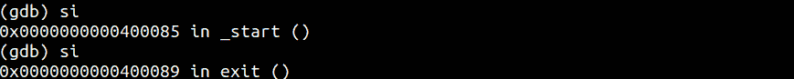
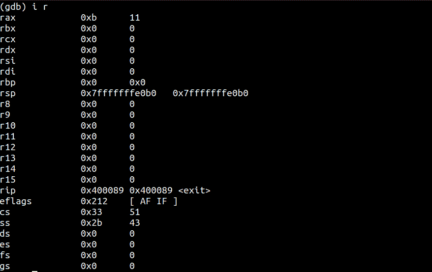

# 第 29 部分- x64 组件[第 3 部分]

> 原文:[https://0x infection . github . io/reversing/pages/part-29-x64-assembly-part-3 . html](https://0xinfection.github.io/reversing/pages/part-29-x64-assembly-part-3.html)

如需所有课程的完整目录，请点击下方，因为除了课程涵盖的主题之外，它还会为您提供每个课程的简介。[https://github . com/mytechnotalent/逆向工程-教程](https://github.com/mytechnotalent/Reverse-Engineering-Tutorial)

今天我们用一个简单的减法例子继续我们的教程。让我们检查一下源代码:

让我们编译并运行调试器:

让我们运行并拆解:

正如我们所见，我们将十六进制数 **16** 或 **0x10** 加载到 **EAX** 中，然后在下一条指令中减去 **5** 。

我们分两步，然后在 **RAX** 中查看结果值。

正如我们所看到的，结果是 0xb 十六进制或 11 十进制，正如预期的那样。在以后的教程中，当我们开始调试 C++代码时，尝试这些简单的例子来掌握会发生什么是很重要的。