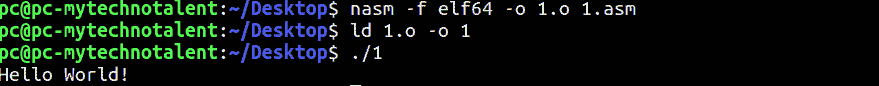

# 第 30 部分- x64 组件[第 4 部分]

> 原文：<https://0xinfection.github.io/reversing/pages/part-30-x64-assembly-part-4.html>

如需所有课程的完整目录，请点击下方，因为除了课程涵盖的主题之外，它还会为您提供每个课程的简介。[https://github . com/mytechnotalent/逆向工程-教程](https://github.com/mytechnotalent/Reverse-Engineering-Tutorial)

今天，我们将在 x64 汇编中编写简单的“hello world”程序。

我们简单地在**中创建一个字符串。data** 段，并在语句末尾添加一个回车符。然后，我们执行一个简单的写调用，利用操作系统的中断向量表在标准输出或终端中输出我们的字符串。

我们将在下面编译并运行:

正如我们看到的" **Hello World** ！"一直回响到终端。下周我们将在 GDB 调试这个简单的程序。