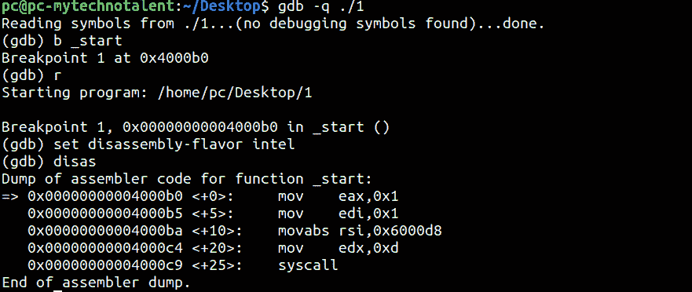

# 第 32 部分- x64 组件[第 6 部分]

> 原文：<https://0xinfection.github.io/reversing/pages/part-32-x64-assembly-part-6.html>

如需所有课程的完整目录，请点击下方，因为除了课程涵盖的主题之外，它还会为您提供每个课程的简介。[https://github . com/mytechnotalent/逆向工程-教程](https://github.com/mytechnotalent/Reverse-Engineering-Tutorial)

让我们回顾一下我们的代码。

编制...

调试...

我们来评估一下 0x6000d8 的内存地址里面有什么。

如我们所见，带有返回字符的“ **Hello World** ”将被移入我们的 **RSI** 寄存器。

下周我们将对此进行更深入的研究。