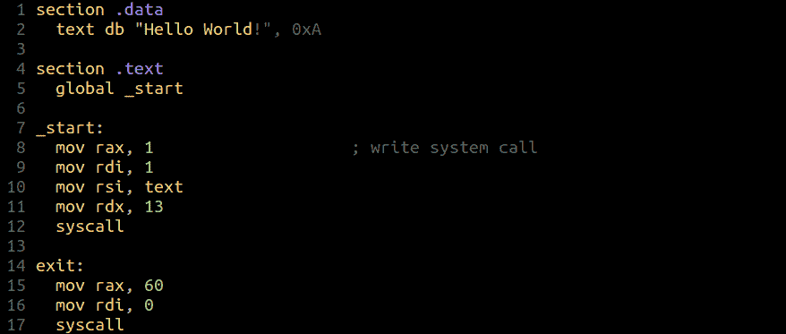
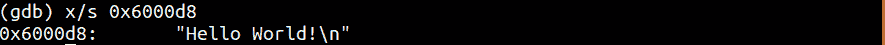
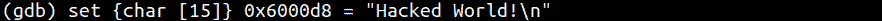
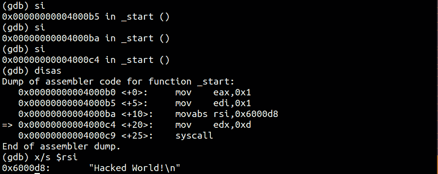
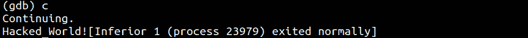

# 第 33 部分- x64 组件[第 7 部分]

> 原文:[https://0x infection . github . io/reversing/pages/part-33-x64-assembly-part-7 . html](https://0xinfection.github.io/reversing/pages/part-33-x64-assembly-part-7.html)

如需所有课程的完整目录，请点击下方，因为除了课程涵盖的主题之外，它还会为您提供每个课程的简介。[https://github . com/mytechnotalent/逆向工程-教程](https://github.com/mytechnotalent/Reverse-Engineering-Tutorial)

让我们再次检查我们的源代码。

让我们编译...

正如我们之前看到的，它产生了我们的弦。

我们调试并看到字符串被移入 **0x6000d8** ，然后是 **RSI** 。

只是为了验证我们可以在前面提到的地址看到字符串。现在来点好玩的:)...

在这里，我们证明了我们有能力简单地在内存中破解和重定义字符串。我们只是简单地设置一个字符字节长度和一个新的字符串。

正如我们所看到的，我们已经成功地改变了内存中的字符串。

我们继续运行二进制文件，看到我们的攻击继续通过 **RSI** 。

最后，我们看到当我们运行二进制文件时，我们成功地破解了它的操作。这是一个非常简单的例子，但是显示了在这个层次上真正理解汇编的力量。GUI 调试器工具也将提供这种功能，但是我喜欢使用命令行工具，这样它们可以在任何环境下使用。

这些工具的目的是了解这是如何做到的，以及当你专业地实时倒车时需要寻找什么。您需要了解攻击者是如何改变内存和/或指令的。我们需要更多的专业 re 来帮助保卫世界各地的基础设施，希望这些教程能激励你走向这样的职业生涯。