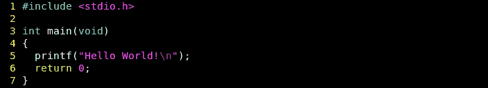
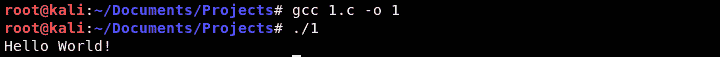
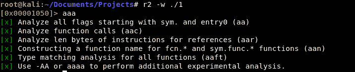
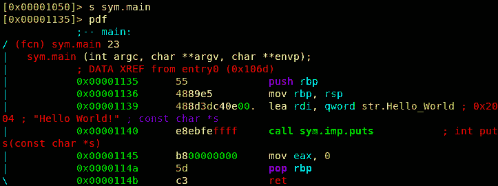
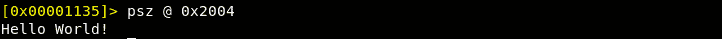
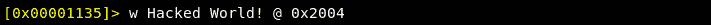
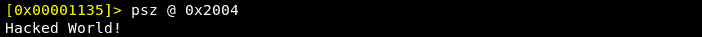
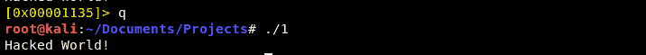

# 第 40 部分-黑客你好世界！

> 原文：<https://0xinfection.github.io/reversing/pages/part-40-hacking-hello-world!.html>

如需所有课程的完整目录，请点击下方，因为除了课程涵盖的主题之外，它还会为您提供每个课程的简介。[https://github . com/mytechnotalent/逆向工程-教程](https://github.com/mytechnotalent/Reverse-Engineering-Tutorial)

好了，是时候让我们看看最基本的 C 程序了，调试它，破解它。如果我们要掌握，我们必须一步到位地创造和毁灭，这样我们就掌握了领域。

让我们启动 VIM 并输入以下内容。我们包含了我们的标准库，并创建了一个 main 函数，我们使用 printf 的库函数来返回一串字符，因为 main 的类型是 int，也就是 integer，所以我们返回 0。

让我们编译一下，看看运行时会发生什么:

正如我们在 C++例子中看到的，我们看到了' **Hello World！**回显成功。

让我们在 Radare 中调试:

这很简单，我们用 **aaa** 来分析二进制，并用**的 sym.main** 来找 main。

让我们看看装配并分析:

组装！原始性感的定义！

我在之前的汇编课程中已经详细讲解过了，现在让我们回顾一下。

1)我们**将 rbp** 推入堆栈，这意味着我们将当前在基指针中的值推入堆栈。

2)We **lea rdi，qword str。Hello_World** ，这意味着我们将字符串的四字有效地址加载到 **rdi** 寄存器中。到目前为止，您应该很容易理解。

3)然后我们**调用 sym.imp.puts** um wait！我们用 **printf** 搞什么鬼！我们的编译器优化了我们的代码，编译器选择了 stdio 库中的 **puts** 函数将字符串回显到我们的终端。再简单不过了。

4)我们清空 **eax** ，然后将 **rbp** 寄存器中的原始值弹出回到 **rbp** 中。如果您对本系列的前一部分感到困惑，请。

我们知道我们的字符串'你好，世界！住在弗吉尼亚州阿灵顿的一所漂亮的房子里，地址是 **0x2004** 好吧，它不是弗吉尼亚州阿灵顿，但它在映射内存中(因为我们不是在技术上调试，我们是在处理映射代码，意思是磁盘上的相同值)。

为了确认我们在 **0x2004** 看到的值是“ **Hello World！**‘让我们用 **w** 命令把那个值砍成我们想要的任何值，然后直接写到那个映射的内存地址。

让我们重新审视谁现在住在我们弗吉尼亚州阿灵顿的房子里！

成功！我们破解了这个值，当我们退出调试器时，我们看到:

我们成功地改变了二进制文件。

这里有很多东西需要消化。如果你被难住了，请在评论中提问！不要继续了，因为我是来帮忙的。在我们继续之前，您必须了解这些最基本的事情，这一点非常重要！