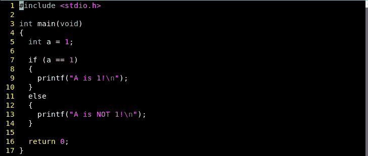
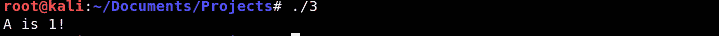
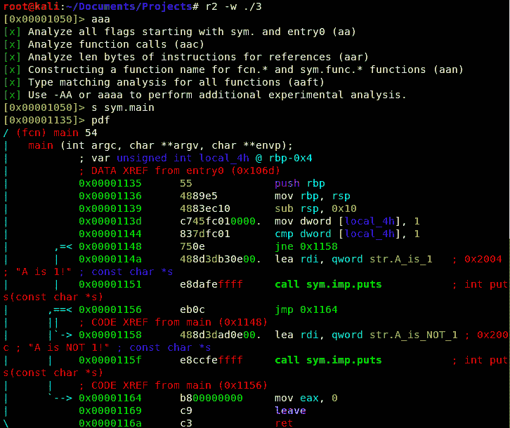
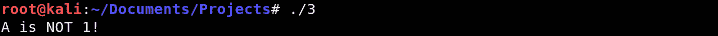

# 第 42 部分-黑客分行！

> 原文:[https://0x infection . github . io/reversing/pages/part-42-hacking-branches！。html](https://0xinfection.github.io/reversing/pages/part-42-hacking-branches!.html)

如需所有课程的完整目录，请点击下方，因为除了课程涵盖的主题之外，它还会为您提供每个课程的简介。[https://github . com/mytechnotalent/逆向工程-教程](https://github.com/mytechnotalent/Reverse-Engineering-Tutorial)

让我们来看看一些分支逻辑:

我们可以清楚地看到，我们将一个 int 初始化为 1，如果变量等于 1，第一个 if 语句将输出一个对标准输出的响应。

我们来编译一下:

我们跑吧:

正如我们逻辑上看到的，第一个分支被采用。让我们把它带进 Radare，参观一下装配:

我们可以看到带有浅绿色箭头的分支逻辑。在 **0x0000114a** 我们看到我们的第一个分支被加载到 **rdi** 中。请注意在 **0x00001148** 我们看到一个 **jne 0x1158** 。在 **0x00001158** 处，我们看到第二个分支被加载到 **rdi** 中。

**jne** 表示不相等时跳转。这意味着如果在 **0x00001144** 中被比较的内容不等于 1(我们看到 **1** 正在与 **local_4h** 中的内容进行比较，我们知道后者是实际在 **rbp-0x4** 中的伪代码)。这应该是有意义的，因为我上周已经详细讲解过了，如果你感到困惑，请重温我们上一课。

为了破解，我们简单地对 **je** 作出 **jne** 语句，如果相等则跳转，我们知道 **cmp** or 比较是相等的，所以它现在将分支到" **A 不是 1！**”。

当我们退出 Radare 时，我们可以看到我们已经成功地破解了二进制文件:

敬请期待！