# 第 43 部分-黑客指针！

> 原文:[https://0x infection . github . io/reversing/pages/part-43-hacking-pointers！。html](https://0xinfection.github.io/reversing/pages/part-43-hacking-pointers!.html)

如需所有课程的完整目录，请点击下方，因为除了课程涵盖的主题之外，它还会为您提供每个课程的简介。[https://github . com/mytechnotalent/逆向工程-教程](https://github.com/mytechnotalent/Reverse-Engineering-Tutorial)

我们在路的尽头。这是 x64 系列的最终视频。最后一个主题是指针。

什么是指针？让我们从一个例子开始。

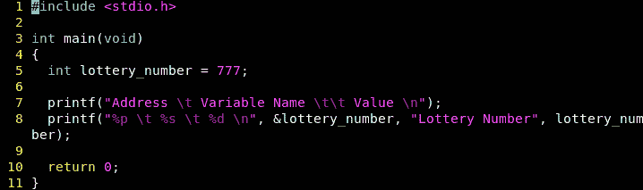

指针只不过是一个内存地址。当我们编译时，我们将清楚地看到 lottery_number 在映射内存中的位置(这是一个运行的例子，不像我们的非映射 Radare 例子)。

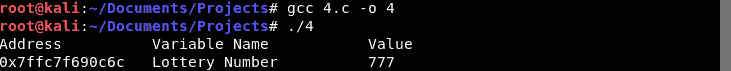

让我们给这个例子添加一个真实的指针:

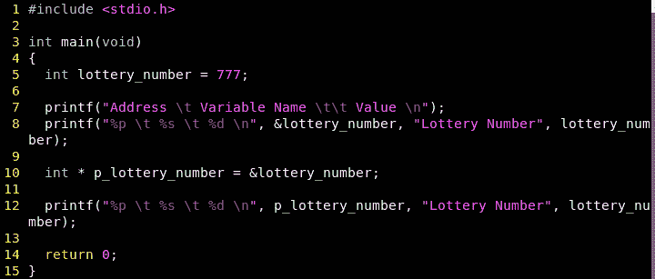

我们看到了同样的价值:

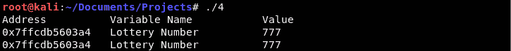

让我们做更多的实验:

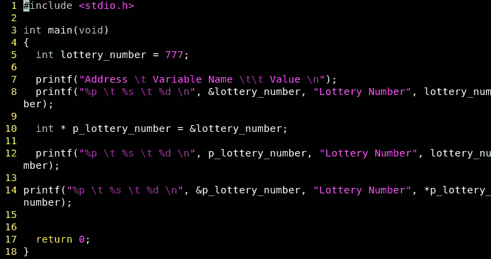

我们看到指针地址指向一个新地址:

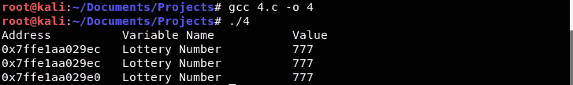

记住指针是其他变量的内存地址。让我们从另一个角度来看:

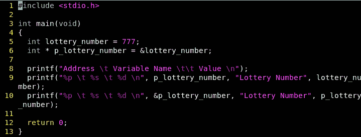

让我们编译:

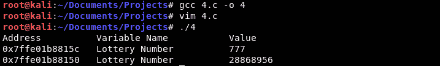

我们遵从以下做法:

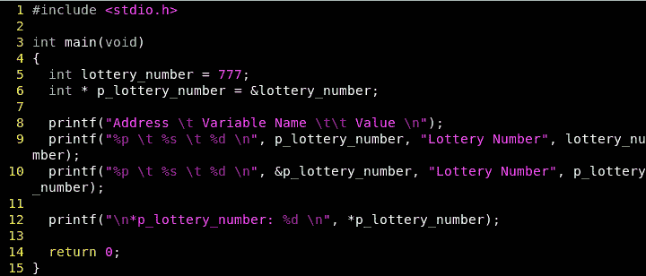

然后我们编译:

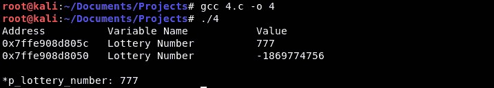

我们可以看到顺从指针等于 777。

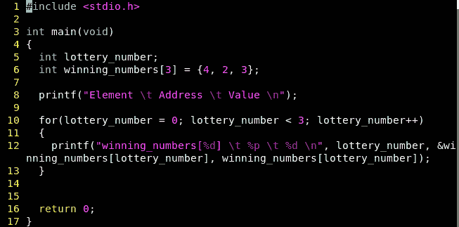

我们可以看到一个数组的例子:

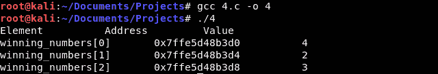

我们来调试一下:

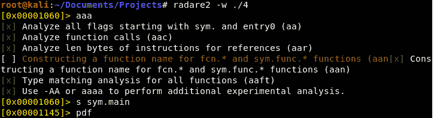

然后我们拆解:

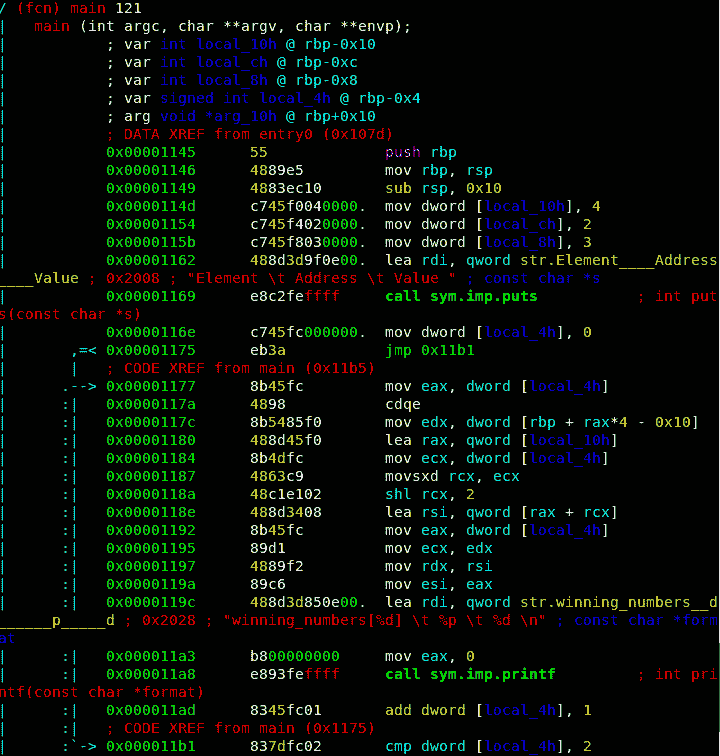

我们黑吧！

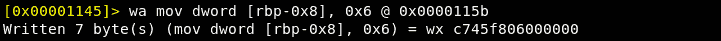

让我们重新检查二进制:

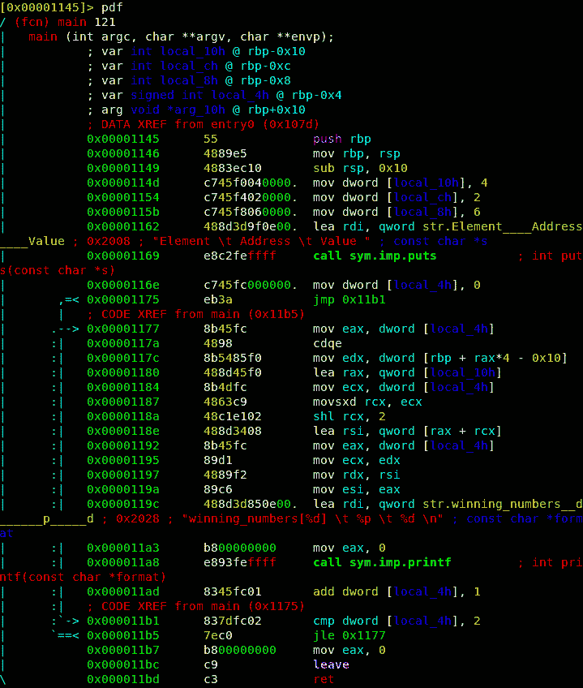

我们可以看到我们用 6 黑掉了 3 的值。

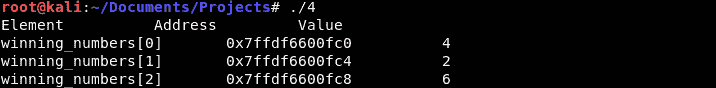

我们可以看到我们已经成功入侵了。

我希望这些年来，通过数百个 x86、ARM 和 x64 教程，您能够了解如何通过了解敌人的工作方式来保护关键基础架构免受恶意攻击。去好好工作吧！