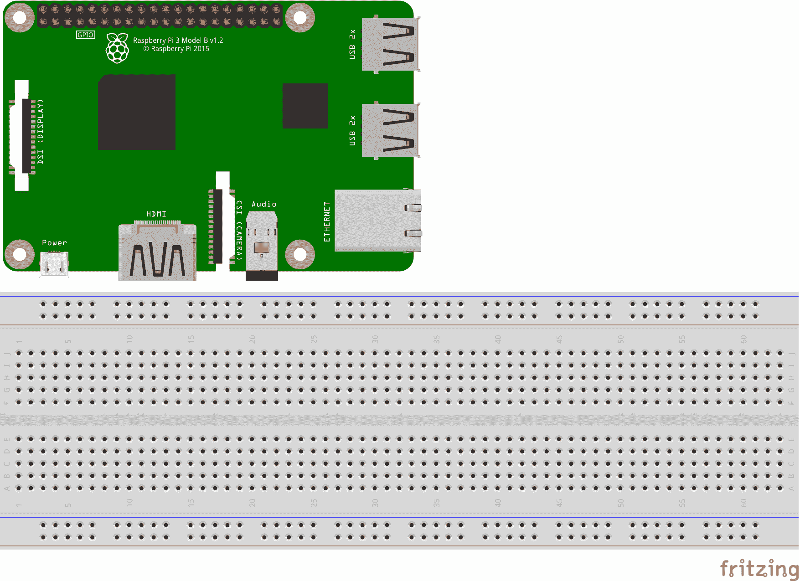

# 第 2 部分-开发设置

> 原文：<https://0xinfection.github.io/reversing/pages/part-2-development-setup.html>

如需所有课程的完整目录，请点击下方，因为除了课程涵盖的主题之外，它还会为您提供每个课程的简介。[https://github.com/mytechnotalent/hacking\_c-\_arm64](https://github.com/mytechnotalent/hacking\_c-\_arm64)

今天，我们将设置我们的开发环境。我们将需要以下内容:

```
Raspberry Pi 4
64GB MicroSD Card
Micro SD Card Reader/Writer
Download 64-bit Kali Linux ARM Image
Download balenaEtcher
Flash Kali Linux ARM Image
OPTIONAL: Video [Load Kali RPI 4]
How To Install VIM
Git Clone & Build Radare2 Software

```



**树莓派 4**

[https://www.adafruit.com/product/4292](https://www.adafruit.com/product/4292)

**64GB MicroSD 卡**

[https://www.sparkfun.com/products/16498](https://www.sparkfun.com/products/16498)

**微型 SD 卡读写器**

[https://www . Walmart . com/IP/io gear-GFR 204 SD-SD-MicroSD-MMC-Card-Reader-and-Writer/15522266](https://www.walmart.com/ip/Iogear-GFR204SD-SD-MicroSD-MMC-Card-Reader-and-Writer/15522266)

**下载 64 位 Kali Linux ARM 镜像**

kali Linux RaspberryPi 2(1.2 版)、3 和 4 (64 位)(img.xz)

[https://www.offensive-security.com/kali-linux-arm-images](https://www.offensive-security.com/kali-linux-arm-images)

**下载 balenaEtcher**

[https://www.balena.io/etcher](https://www.balena.io/etcher)

**闪光卡利臂图像**

**可选:视频【加载 Kali RPI 4】**

[https://youtu . be/jquf 9 bdm 4 iu](https://youtu.be/Jquf9BDm4iU)

**如何安装 VIM**

[https://www.simplified.guide/ubuntu/install-vim](https://www.simplified.guide/ubuntu/install-vim)

获得所有必要的设备和软件后，请观看视频，了解如何设置您的环境，因为 Null Byte 通过一步一步的教程完成了令人惊叹的工作，它将在几分钟内让您完成设置。

下一步是 git 克隆和构建 Radare2 软件，因为我们需要最新版本，因为 Kali 中内置的标准版本不足以满足我们的需求。

**Git 克隆&构建 Radare2 软件**

[https://github . com/radar eorg/radar 2](https://github.com/radareorg/radare2)

```
cd Documents
git clone https://github.com/radareorg/radare2.git
sys/install.sh

```

最后，我们将使用文本编辑器来构建我们的代码。Kali 内置了 VIM 和 Nano 文本编辑器。我们将使用 VIM，但是您可以随意使用您喜欢的任何一种。

在下一课中，我们将编写我们的第一个 C++程序“Hello World！”。