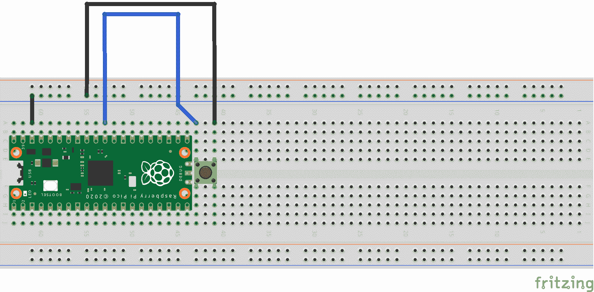

# 第 2 部分- Hello World

> 原文:[https://0x infection . github . io/reversing/pages/part-2-hello-world . html](https://0xinfection.github.io/reversing/pages/part-2-hello-world.html)

今天我们将介绍在 Raspberry Pi Pico 上创建我们自己的项目的基本设置。

在我们的 **pico** 文件夹中，让我们在 **pico-sdk** 和 **pico-example** 文件夹旁边创建一个 **0x02_pico_hello_world** 文件夹。

```
mkdir 0x02_pico_hello_world
cd 0x02_pico_hello_world

```

让我们创建我们的 vim **0x02_hello_world.c** 文件。

```
vim 0x02_hello_world.c

```

下面补充一下。

```
#include <stdio.h>
#include "pico/stdlib.h"

int main() 
{    
  stdio_init_all();

  while(1) 
  {
    printf("Hello world!\n");

    sleep_ms(1000);
  }

  return 0;
}

```

我们首先处理初始化所有标准输入和输出的逻辑。

```
    stdio_init_all();

```

最后我们打印出*“你好，世界！”*每 1 秒向标准输出一次无限循环。

```
    while(1) 
    {
      printf("Hello world!\n");

      sleep_ms(1000);
    }

```

然后我们在成功后*返回 0* 来表示成功，因为我们的*主*函数是一个 int。这在技术上不是必需的，但却是良好的实践。

```
    return 0;

```

使用 **cmake** 对我们项目的构建过程有很大的帮助。我们首先需要制作一个 **CMakeLists.txt** 文件。

```
cmake_minimum_required(VERSION 3.13)

include(pico_sdk_import.cmake)

project(test_project C CXX ASM)
set(CMAKE_C_STANDARD 11)
set(CMAKE_CXX_STANDARD 17)
pico_sdk_init()

add_executable(0x02_hello_world
  0x02_hello_world.c
)

pico_enable_stdio_usb(0x02_hello_world 1)

pico_add_extra_outputs(0x02_hello_world)

target_link_libraries(0x02_hello_world pico_stdlib)

```

接下来我们需要将 **pico_sdk_import.cmake** 文件从 **pico-sdk** 安装的外部文件夹复制到 **0x02_hello_world** 项目文件夹。

```
cp ../pico-sdk/external/pico_sdk_import.cmake .

```

最后，我们准备建造。

```
mkdir build
cd build
export PICO_SDK_PATH=../../pico-sdk
cmake ..
make

```

这将产生许多文件，我们将重点关注的是**。elf** 文件，这是完整的程序输出，可能包括调试信息和 **.uf2** 文件，这是 uf2 格式的程序代码和数据，当它作为 USB 驱动器安装时，您可以拖放到 RP2040 板上。

我花时间在 Pico 上连接了一个重置按钮，这样我就不必每次需要重新刷新时都拔掉 USB 并按下 BOOTSEL，所以这里是这样的示意图。



要闪烁，请按下外部按钮，同时按下板上的 BOOTSEL，然后松开 BOOTSEL，最后松开外部按钮。

然后只需将 **.uf2** 文件复制到驱动器即可。

```
cp 0x02_hello_world.uf2 /Volumes/RPI-RP2

```

然后，我们需要找到 USB 驱动器，以便您可以执行以下操作。

```
ls /dev/tty.

```

按 tab 找到驱动器，然后在我的情况下，我将使用**屏幕**进行连接。

```
screen /dev/tty.usbmodem0000000000001

```

万岁！你应该看到，“你好，世界！”到每秒的标准输出。

在下一课中，我们将调试**。精灵**双星在**雷达 2** 中。