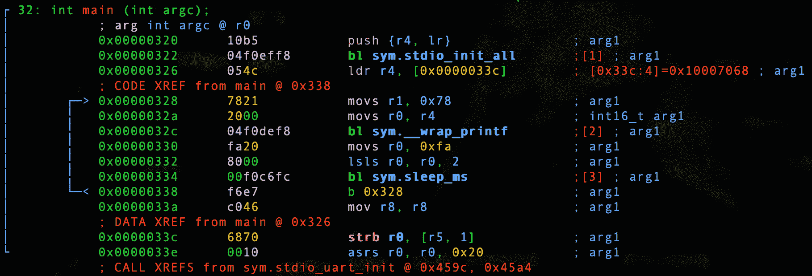

# 第 7 部分-黑客字符

> 原文：<https://0xinfection.github.io/reversing/pages/part-7-hacking-char.html>

今天我们破解了简单的 char 程序。

让我们回顾一下我们的代码。

```
#include <stdio.h>
#include "pico/stdlib.h"

int main() 
{
  stdio_init_all();

  while(1) 
  {
    char x = 'x';

    printf("%c\n", x);

    sleep_ms(1000);
  }

  return 0;
}

```

让我们启动我们的调试器。

```
radare2 -w arm -b 16 0x03_char.elf

```

让我们自动分析。

```
aaaa

```

让我们去找 main。

```
s main

```

让我们通过键入 **V** 和 **p** 两次进入可视化模式，以获得一个好的调试器视图。



在上一课中，我们分解了每一行。在这里，我们显然对破解 0x78 的值并将其更改为我们想要的任何值感兴趣。我们试试 0x79。这个简单的程序将把字符*‘x’*转换成*‘y’*。

```
:> wa movs r1, 0x79 @ 0x00000328
Written 2 byte(s) (movs r1, 0x79) = wx 7921

```

我们来验证一下变化。

```
:> pd 1 @ 0x00000328
│           ; CODE XREF from main @ 0x338
│           0x00000328      7921           movs r1, 0x79               ; 'y' ; arg1

```

在这种情况下，我们的调试器甚至告诉我们，它实际上是*‘y’*除此之外，现在我们正在将十六进制 ascii 值移入 0x79，再移入 *r1* 。

让我们也把睡眠时间缩短到 2000 毫秒或 2 秒。

```
:> wa lsls r0, r0, 3 @ 0x00000332
Written 2 byte(s) (lsls r0, r0, 3) = wx c000

```

在这里，我们简单地向左逻辑移位 3 次，因此 250 x 2 = 500，500 x 2 = 1000，1000 x 2 = 2000。

我们来验证一下。

```
:> pd 1 @ 0x00000332
│           0x00000332      c000           lsls r0, r0, 3

```

我们现在要做的就是退出并转换我们的**。精灵**到 **.uf2** ！

```
./elf2uf2/elf2uf2 0x03_char.elf 0x03_char.uf2

```

插入 Pico 并确保按住 BOOTSEL 或使用我在第 2 部分中提供的设置。

```
cp 0x03_char.uf2 /Volumes/RPI-RP2

```

我们来筛选一下吧！

```
screen /dev/tty.usbmodem0000000000001

```

啊，耶！

```
y
y
y
y
y
y

```

我们每两秒钟就会看到“y”被打印出来！

在下一课中，我们将讨论 int 数据类型。