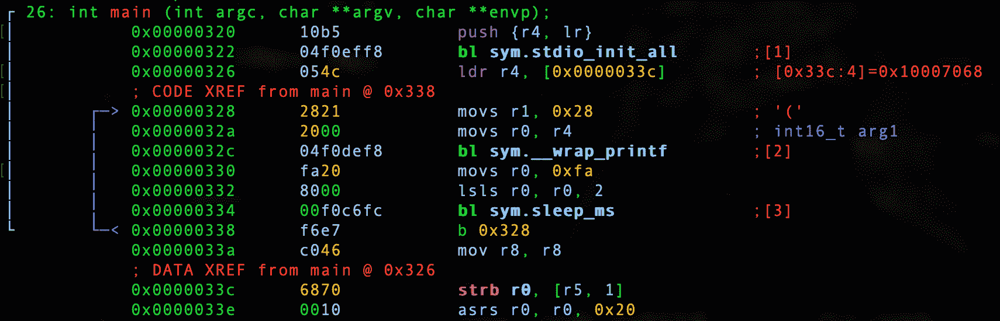

# 第 9 部分-调试 int

> 原文：<https://0xinfection.github.io/reversing/pages/part-9-debugging-int.html>

今天我们要调试我们非常简单的 int 程序。让我们回顾一下代码。

**0x04_int.c**

```
#include <stdio.h>
#include "pico/stdlib.h"

int main() 
{
  stdio_init_all();

  while(1) 
  {
    int x = 40; 

    printf("%d\n", x); 

    sleep_ms(1000);
  }

  return 0;
}

```

让我们启动我们的调试器。

```
radare2 -w arm -b 16 0x04_int.elf

```

让我们自动分析。

```
aaaa

```

让我们去找 main。

```
s main

```

让我们通过键入 **V** 和 **p** 两次进入可视化模式，以获得一个好的调试器视图。



我们从设置主返回值开始。

```
push {r4, lr}

```

我们称标准 I/O 为 init。

```
bl sym.stdio_init_all

```

然后，我们将格式修饰符%d 加载到 *r4* 中。

```
ldr r4, [0x0000033c]

```

我们可以证明。

```
:> psz @ [0x0000033c]
%d

```

然后我们将我们的 int*‘40’*加载到*R1 _ 这是 _0x28* 十六进制。

```
movs r1, 0x28

```

我们可以证明。

```
:> ? 0x28
int32   40
uint32  40
hex     0x28
octal   050
unit    40
segment 0000:0028
string  "("
fvalue: 40.0
float:  0.000000f
double: 0.000000
binary  0b00101000
ternary 0t1111

```

然后我们将我们的格式修改器移动到 *r0* 中。

```
movs r0, r4 

```

然后我们分支到 printf 包装器并调用它。

```
bl sym.__wrap_printf

```

然后我们将 250 十进制或 0xfa 十六进制移入 *r0* 。

```
movs r0, 0xfa

```

然后我们移动 250 个十进制数，我们知道当逻辑左移两次时，1000 个十进制数或 0xfa 个十六进制数将被移入 *r0* 。

```
lsls r0, r0, 2

```

然后我们调用 sleep_ms 函数。

```
bl sym.sleep_ms

```

然后我们无限地继续 while 循环。

```
b 0x328

```

在下一课中，我们将破解这个非常简单的二进制文件。