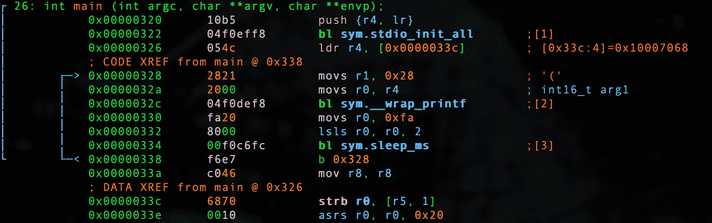

# 第 10 部分-黑客入侵

> 原文：<https://0xinfection.github.io/reversing/pages/part-10-hacking-int.html>

今天我们破解了简单的 int 程序。让我们回顾一下代码。

**0x04_int.c**

```
#include <stdio.h>
#include "pico/stdlib.h"

int main() 
{
  stdio_init_all();

  while(1) 
  {
    int x = 40; 

    printf("%d\n", x); 

    sleep_ms(1000);
  }

  return 0;
}

```

让我们启动我们的调试器。

```
radare2 -w arm -b 16 0x04_int.elf

```

让我们自动分析。

```
aaaa

```

让我们去找 main。

```
s main

```

让我们通过键入 **V** 和 **p** 两次进入可视化模式，以获得一个好的调试器视图。



我们将首先破解 int 值，我们知道它是十进制的 *40* 或十六进制的 *28* 。

```
:> wa movs r1, 0x30 @ 0x00000328
Written 2 byte(s) (movs r1, 0x30) = wx 3021

```

这里我们看到 *0x30* 是 *48* 十进制。

```
:> ? 0x30
int32   48
uint32  48
hex     0x30
octal   060
unit    48
segment 0000:0030
string  "0"
fvalue: 48.0
float:  0.000000f
double: 0.000000
binary  0b00110000
ternary 0t1210

```

我们还看到，十进制的 *0xfa* 我们知道是 *250* 是我们的 1/4 毫秒延迟，当左移两次时，它相乘，变成 1 秒延迟的十进制的 *1000* 。

```
:> ? 0xfa
int32   250
uint32  250
hex     0xfa
octal   0372
unit    250
segment 0000:00fa
string  "\xfa"
fvalue: 250.0
float:  0.000000f
double: 0.000000
binary  0b11111010
ternary 0t100021

```

让我们把它缩减到十进制的 50。

```
:> wa movs r0, 0x32 @ 0x00000330
Written 2 byte(s) (movs r0, 0x32) = wx 3220

```

我们可以看到它实际上是十进制的 *50* 。

```
:> ? 0x32
int32   50
uint32  50
hex     0x32
octal   062
unit    50
segment 0000:0032
string  "2"
fvalue: 50.0
float:  0.000000f
double: 0.000000
binary  0b00110010
ternary 0t1212

```

让我们只将它左移一次，这样当它只左移一次时，它将取十进制数 *50* 并将其转换为 *100* 。

```
:> wa lsls r0, r0, 1 @ 0x00000332
Written 2 byte(s) (lsls r0, r0, 1) = wx 4000

```

我们现在要做的就是退出并转换我们的**。精灵**到 **.uf2** ！

```
./elf2uf2/elf2uf2 0x04_int.elf 0x04_int.uf2

```

插入 Pico 并确保按住 BOOTSEL 或使用我在第 2 部分中提供的设置。

```
cp 0x04_int.uf2 /Volumes/RPI-RP2

```

我们来筛选一下吧！

```
screen /dev/tty.usbmodem0000000000001

```

啊，耶！

```
48
48
48
48
48
48
48
48
48
48
48
48
48
48
48
48
48
48
48
48

```

在这里，我们看到我们将它压缩为 48 进制，它每 100 毫秒打印一次！

在我们的下一课中，我们将处理浮点以及 Pico 处理它们的独特方式，因为它没有协处理器。