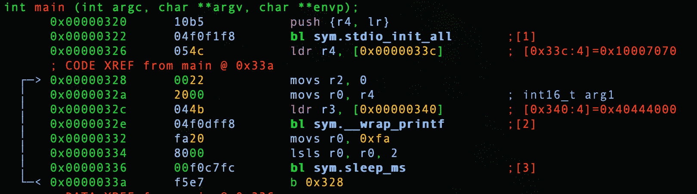

# 第 13 部分-黑客浮动

> 原文：<https://0xinfection.github.io/reversing/pages/part-13-hacking-float.html>

让我们回顾一下我们的例子。 **0x05_float.c** 如下。

```
#include <stdio.h>
#include "pico/stdlib.h"

int main() 
{
  stdio_init_all();

  while(1) 
  {
    float x = 40.5;

    printf("%f\n", x); 

    sleep_ms(1000);
  }

  return 0;
}

```

让我们启动我们的调试器。

```
radare2 -w arm -b 16 0x05_float.elf

```

让我们自动分析。

```
aaaa

```

让我们去找 main。

```
s main

```

让我们通过键入 **V** 和 **p** 两次进入可视化模式，以获得一个好的调试器视图。



浮动在*【0x 00000340】*。

```
:> pff @ [0x00000340]
0x00004000 = 9.32830524e-09

```

正如我们在上一课中讨论的，不要担心浮动不准确，因为这台机器是 x64 的。重要的是要看到值 *0x00004000* 。

在上一课中，我们还解释了 Pico 处理浮点的方式。让我们复习一些基础知识。

```
0x3ff00000 = 1.000000
0x3ff00001 = 1.000001
0x3ff00002 = 1.000002
...
0x3ff0000f = 1.000015
0x3ff00010 = 1.000016
0x3ff00011 = 1.000017
etc...

```

让我们回到 1.000000，如下所示。

我们的微控制器是一种小字节序架构，因此，如果我们要将 40.5 更改为 1.0，我们需要以相反的字节顺序放置该值...

```
0x3ff00000

```

需要是...

```
0x0000f03f

```

因此，我们需要在下面更改该值。

```
wx 0x0000f03f @ 0x00000340

```

我们现在要做的就是退出并转换我们的**。精灵**到 **.uf2** ！

```
./elf2uf2/elf2uf2 0x05_float.elf 0x05_float.uf2

```

插入 Pico 并确保按住 BOOTSEL 或使用我在第 2 部分中提供的设置。

```
cp 0x05_float.uf2 /Volumes/RPI-RP2

```

我们来筛选一下吧！

```
screen /dev/tty.usbmodem0000000000001

```

啊，耶！

```
1.000000
1.000000
1.000000
1.000000
1.000000
1.000000
1.000000
1.000000
1.000000
1.000000
1.000000
1.000000

```

在这里，我们将值设为 1.000000，并让 1 秒钟的睡眠持续。

在下一课中，我们将讨论 double 数据类型。