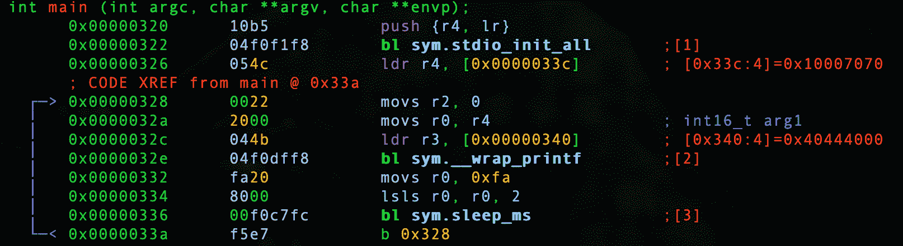
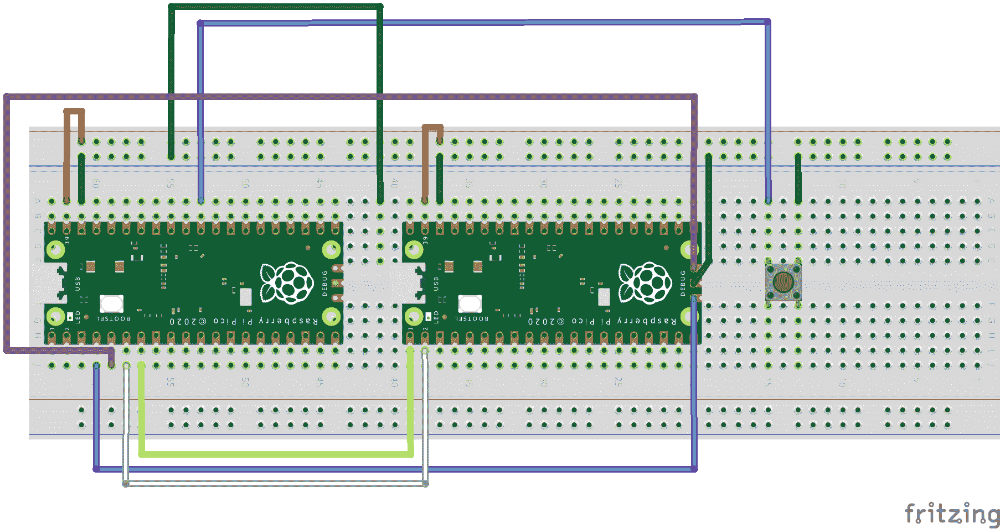
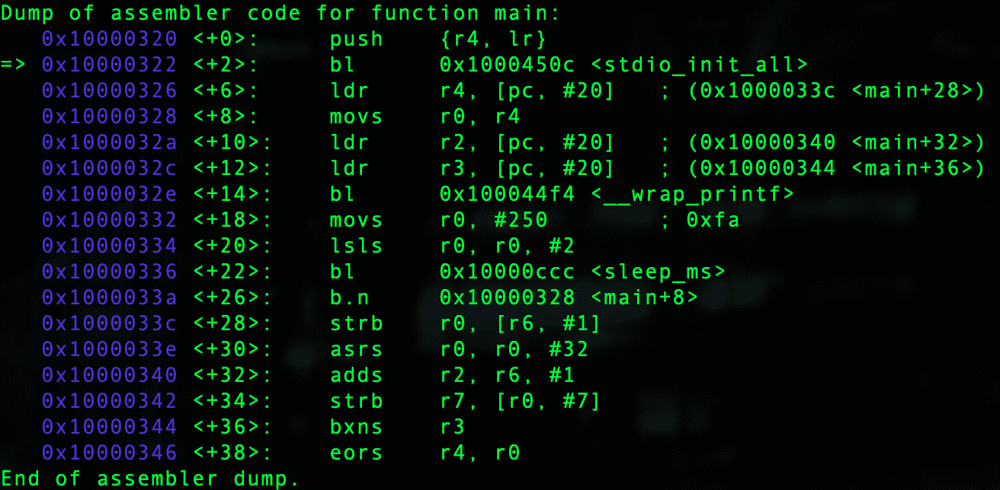

# 第 15 部分-调试双

> 原文：<https://0xinfection.github.io/reversing/pages/part-15-debugging-double.html>

下面我们来回顾一下 **0x06_double.c** 如下。

```
#include <stdio.h>
#include "pico/stdlib.h"

int main() 
{
  stdio_init_all();

  while(1) 
  {
    double x = 40.5;

    printf("%f\n", x); 

    sleep_ms(1000);
  }

  return 0;
}

```

让我们启动我们的调试器。

```
radare2 -w arm -b 16 0x06_double.elf

```

让我们自动分析。

```
aaaa

```

让我们去找 main。

```
s main

```

让我们通过键入 **V** 和 **p** 两次进入可视化模式，以获得一个好的调试器视图。



我们在*【0x 0000033 c】中看到了格式说明符。*

```
:> psz @ [0x0000033c]
%f

```

双精度在*【0x 00000340】*。

```
:> pff @ [0x00000340]
0x00004000 = 9.32830524e-09

```

好的...和浮动课一样，为什么我要浪费时间选择 40.5 呢？

我想向您展示一个明确的证据，当 Pico SDK 功能发挥它的魔力时，编译器会将它视为在 float 范围内，因为没有协处理器。

让我们检查一下我们程序的一个模块。

```
#include <stdio.h>
#include "pico/stdlib.h"

int main() 
{
  stdio_init_all();

  while(1) 
  {
    double x = 40.55555555555555555555;

    printf("%.16f\n", x) 

    sleep_ms(1000);
  }

  return 0;
}

```

当我们编译并运行这个程序时，我们得到如下结果。

```
40.5555555560000000
40.5555555560000000
40.5555555560000000
40.5555555560000000
40.5555555560000000
40.5555555560000000
40.5555555560000000
40.5555555560000000

```

好吧...这个看起来不一样。让我们在本课程中第一次看看 GDB 的动态逆向工程分析。

在这里，您是否在 GDB 运行并设置这一切并不重要，因为在如下所示的配置中，除了需要另一个 Pico 之外，还有大量的步骤。



本课程的范围是理解静态逆向工程，但是我想离开，向你们展示 GDB 用这个新的二进制程序向我们展示了什么。

没有必要使用动态逆向工程，除非您正在处理这样一种情况:您有一个打包的二进制文件，您必须动态加载并写出代码。当您使用动态逆向工程时，它确实使事情变得更容易，但是我想告诉您，静态逆向工程可以获得您需要的一切，而不必设置远程进程来实际运行二进制文件。

如果您发现有必要尝试一下，您需要首先将 OpenOCD repo 安装到我们在本课程开始时创建的 pico 文件夹中。您可以在下面的链接中找到详细信息，并转至数据表中的 **5.1 安装 OpenOCD** 。

[https://datasheets . raspberrypi . org/pico/getting-started-with-pico . pdf](https://datasheets.raspberrypi.org/pico/getting-started-with-pico.pdf)

然后你需要访问下面的页面，使用另一个 Raspberry Pi Pico 下载位于**调试的 uf2，然后用 uf2 刷新第一个 Pico。**

[https://www . raspberrypi . org/documentation/RP 2040/getting-started/\ # board-specifications](https://www.raspberrypi.org/documentation/rp2040/getting-started/\#board-specifications)

**TERMINAL 1** :然后您需要设置第一个终端，进入 openocd 文件夹并运行下面的命令。

```
src/openocd -f interface/picoprobe.cfg -f target/rp2040.cfg -s tcl

```

**TERMINAL 2** :您需要进入项目的构建文件夹，并运行下面的代码。

```
arm-none-eabi-gdb 0x06_double.elf
target extended-remote localhost:3333
load
monitor reset init
b main
c

```

终端 3 :你需要运行屏幕模拟器，它会以闪烁的光标启动。

```
screen /dev/tty.usbmodem14101 115200

```

尽管有了这个简短的解释，让我们在 GDB 动态地回顾一下。



我们在 *0x10000340* 和 *0x10000344* 处看到两个值。

让我们删除所有断点，并在调用 printf 包装之前中断。

```
d
b *0x1000032e
c

```

让我们检查每个位置的值。

```
p/x *0x10000340
0x71c71c72

p/x *0x10000344
0x4044471c

```

我们知道下面的输出是打印的内容。

```
40.5555555560000000
40.5555555560000000
40.5555555560000000
40.5555555560000000
40.5555555560000000
40.5555555560000000
40.5555555560000000
40.5555555560000000
40.5555555560000000

```

现在的情况是，这些值现在分别位于 R2 和 R3。

```
p/x $r2
0x71c71c72

p/x $r3
0x4044471c

```

在 ARM 32 汇编中，函数的参数通过 r0-r3 传递，如果你需要更多的参数，它们会放在堆栈中。在我们的例子中，r0 有我们的格式修饰符。

```
x/s $r0
0x10007070:    "%.16f\n"

```

我们在 r1 中看到一个指向堆栈的值。

```
x/w $r1
0x0:    0x20041f00

p/x *0x20041f00
0xa

```

这是进入 printf 包装器的另一部分，以便正确地将字符串打印到 STDOUT。

在下一课中，我们将静态破解。