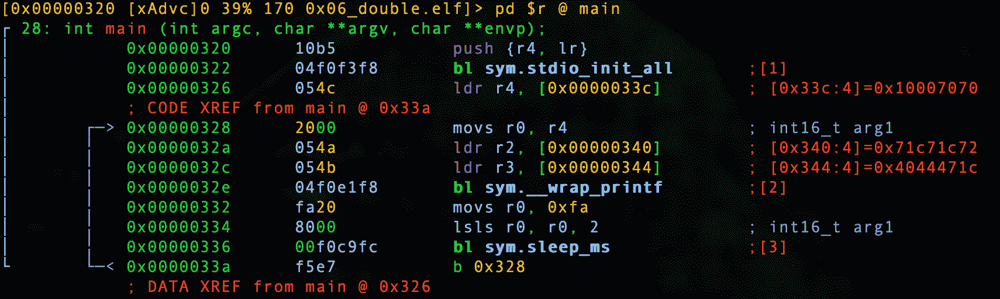

# 第 16 部分-黑客双

> 原文:[https://0x infection . github . io/reversing/pages/part-16-hacking-double . html](https://0xinfection.github.io/reversing/pages/part-16-hacking-double.html)

我们来回顾一下 **0x06_double_MOD.c** 如下。

```
#include <stdio.h>
#include "pico/stdlib.h"

int main() 
{
  stdio_init_all();

  while(1) 
  {
    double x = 40.55555555555555555555;

    printf("%.16f\n", x) 

    sleep_ms(1000);
  }

  return 0;
}

```

让我们启动我们的调试器。

```
radare2 -w arm -b 16 0x06_double.elf

```

让我们自动分析。

```
aaaa

```

让我们去找 main。

```
s main

```

让我们通过键入 **V** 和 **p** 两次进入可视化模式，以获得一个好的调试器视图。



如前所述，我们的微控制器是一种小字节序架构，因此，如果我们要将 40.555555560000000 更改为 1.0，我们需要将该值按相反的字节顺序排列...

```
0x3ff00000

```

需要是...

```
0x0000f03f

```

因此，我们需要在下面更改该值。

```
wx 0x0000f03f @ 0x00000344

```

我们现在要做的就是退出并转换我们的**。精灵**到 **.uf2** ！

```
./elf2uf2/elf2uf2 0x06_double.elf 0x06_double.uf2

```

插入 Pico 并确保按住 BOOTSEL 或使用我在第 2 部分中提供的设置。

```
cp 0x06_double.uf2 /Volumes/RPI-RP2

```

我们来筛选一下吧！

```
screen /dev/tty.usbmodem0000000000001

```

啊，耶！

```
1.0000002380000000
1.0000002380000000
1.0000002380000000
1.0000002380000000
1.0000002380000000
1.0000002380000000
1.0000002380000000
1.0000002380000000
1.0000002380000000
1.0000002380000000
1.0000002380000000
1.0000002380000000
1.0000002380000000
1.0000002380000000
1.0000002380000000

```

现在我们应该对 C 中的数据类型有了很好的理解，来看看一些稍微大一点的概念。

在下一课中，我们将开始讨论输入。