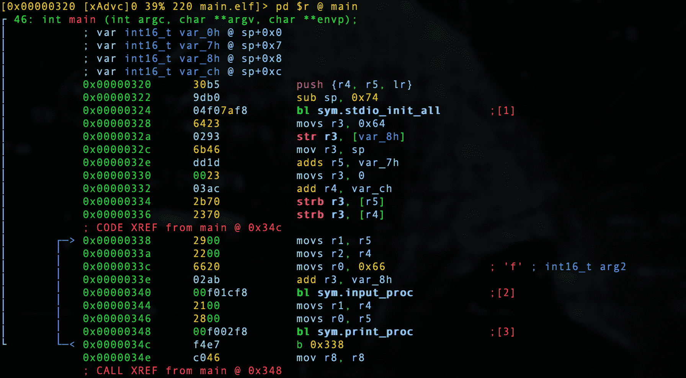
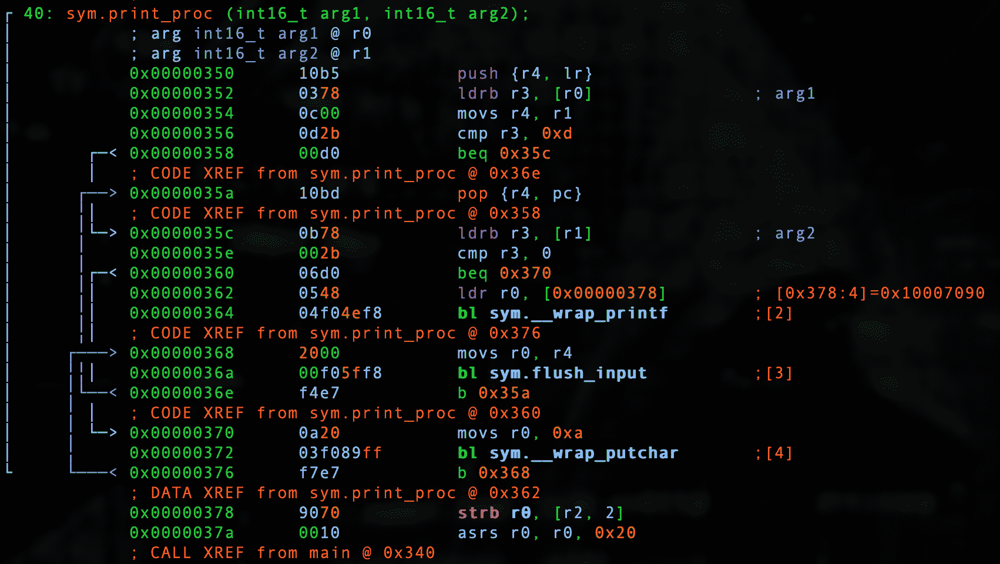
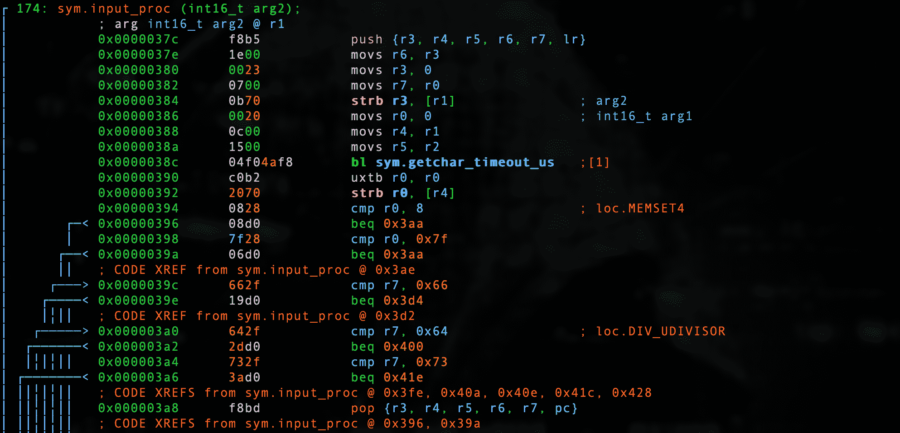
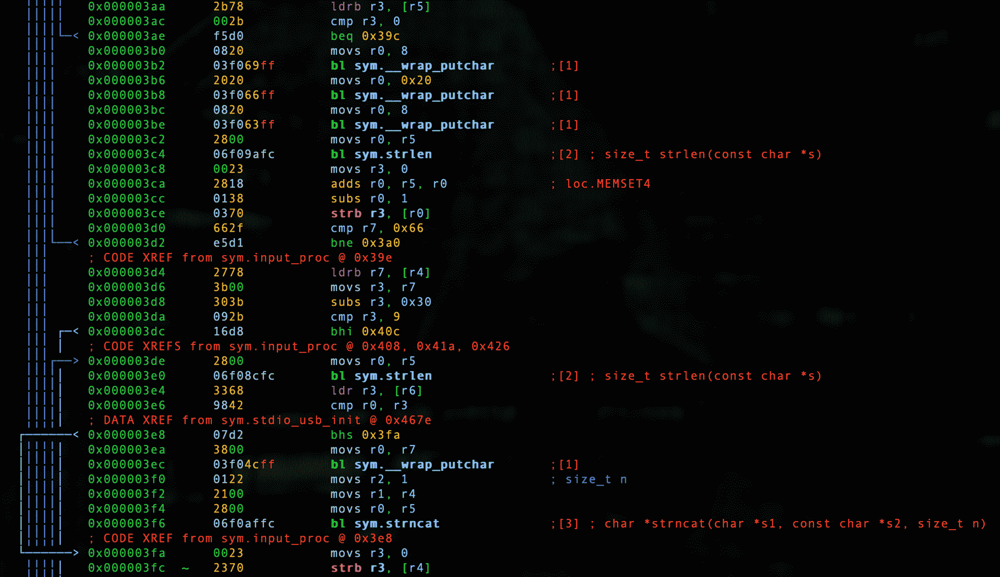
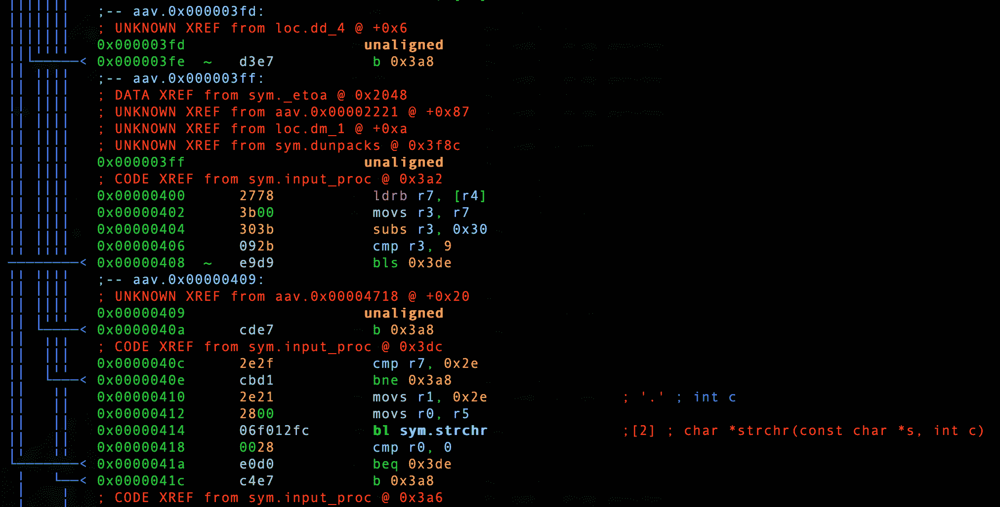
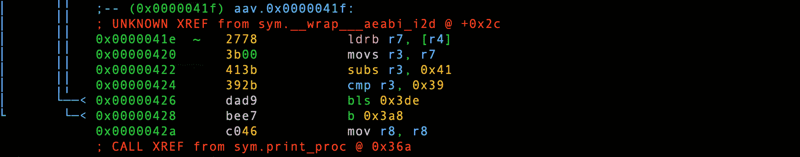
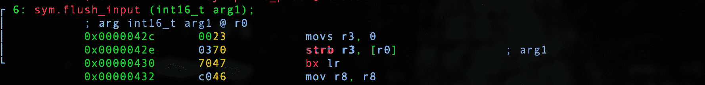

# 第 20 部分-调试输入

> 原文:[https://0x infection . github . io/reversing/pages/part-20-debugging-input . html](https://0xinfection.github.io/reversing/pages/part-20-debugging-input.html)

今天我们将调试我们的输入函数。让我们回顾一下我们的代码。

按如下方式检查**输入。**

```
#include <stdio.h>
#include <string.h>
#include "pico/stdlib.h"

#define ZERO 0x30
#define NINE 0x39
#define PERIOD 0x2e
#define CAPITAL_A 0x41
#define LOWER_CASE_Z 0x7a
#define BACKSPACE 0x08
#define DEL 0x7f

void input_proc(char type, char* p_usb_char, char* p_usb_string, const int* p_USB_STRING_SIZE)
{
  *p_usb_char = '\0';
  *p_usb_char = getchar_timeout_us(0);
  if(*p_usb_char == BACKSPACE || *p_usb_char == DEL)
  {
    if(p_usb_string[0] != '\0')
    {
      printf("\b");
      printf(" ");
      printf("\b");
      p_usb_string[strlen(p_usb_string)-1] = '\0';
    }
  }
  if(type == 'f')
  { 
    char* period;
    while((*p_usb_char >= ZERO && *p_usb_char <= NINE) || *p_usb_char == PERIOD)
    {
      if(*p_usb_char == PERIOD)
        period = strchr(p_usb_string, '.');
      if(period == NULL) 
      {
        if(strlen(p_usb_string) < *p_USB_STRING_SIZE)
        {
          putchar(*p_usb_char);
          strncat(p_usb_string, p_usb_char, 1);
        }
        *p_usb_char = '\0';
      }
      else
        break;
    }
  }
  else if(type == 'd')
  { 
    while(*p_usb_char >= ZERO && *p_usb_char <= NINE)
    {
      if(strlen(p_usb_string) < *p_USB_STRING_SIZE)
      {
        putchar(*p_usb_char);
        strncat(p_usb_string, p_usb_char, 1);
      }
      *p_usb_char = '\0';
    }
  }
  else if(type == 's')
  { 
    while(*p_usb_char >= CAPITAL_A && *p_usb_char <= LOWER_CASE_Z)
    {
      if(strlen(p_usb_string) < *p_USB_STRING_SIZE)
      {
        putchar(*p_usb_char);
        strncat(p_usb_string, p_usb_char, 1);
      }
      *p_usb_char = '\0';
    }
  }
}

void flush_input(char* p_usb_string)
{
  p_usb_string[0] = '\0';
}

```

回顾我们的 **print.c** 如下。

```
#include <stdio.h>
#include "pico/stdlib.h"
#include "input.h"

#define RETURN 0x0d

void print_proc(char* p_usb_char, char* p_usb_string)
{
  if(*p_usb_char == RETURN)
  {
    if(p_usb_string[0] == '\0')
      printf("\n");
    else
      printf("\n%s\n", p_usb_string);
    flush_input(p_usb_string);
  }
}

```

回顾我们的 **main.c** 如下。

```
#include <stdio.h>
#include "pico/stdlib.h"
#include "print.h"
#include "input.h"

int main()
{
  stdio_init_all();

  const int USB_STRING_SIZE = 100;
  char usb_char;
  usb_char = '\0';
  char usb_string[USB_STRING_SIZE];
  usb_string[0] = '\0';

  while(1)
  {   
    input_proc('f', &usb_char, usb_string, &USB_STRING_SIZE);
    print_proc(&usb_char, usb_string);
  }

  return 0;
}

```

让我们启动我们的调试器。

```
radare2 -w arm -b 16 main.elf

```

让我们自动分析。

```
aaaa

```

让我们去找 main。

```
s main

```

让我们通过键入 **V** 和 **p** 两次进入可视化模式，以获得一个好的调试器视图。

我们先回顾一下*主*。



我们看到我们的 *stdio_init_all* 调用设置了 io，我们看到一个 *0x64* 进入 *r3* ，这是我们移动十进制 100 来设置*USB _ STRING _ SIZE _ 并且我们设置了我们的 _usb_char* 值和 init 为 *0* ，最后是 *usb_string* 和 init 为 *0* 。

让我们看看我们的 *print_proc* 函数。



我们首先检查我们指向 usb_char 或 *p_usb_char* 的指针是否等于*回车键*或 *0xd* ，如果是，则分支。

然后我们迭代 p_usb_string 直到遇到空终止符，然后调用我们的 _printf _function，正如我们在这里看到的，它是 c printf 函数的包装器。

我们最后 *flush_input* 。

我们的 *input_proc* 函数稍微复杂一点。



这里我们使用 g*etcar _ time out _ us*函数并处理*退格键*和*删除键*。



然后，我们针对 0 *和 _9* 调用我们的 *putchar _wrapper，并检查 *strlen* ，用 *strncat* 正确构建我们的字符串。*



然后，我们适当地处理我们的*周期*逻辑，以确保只输入一个 _ PERIOD _ 作为浮点数，不能处理 2 个周期。



然后，我们适当地处理我们的循环。

最后，我们有了我们的 *flush_input* 函数。



这里，我们简单地通过将 *p_usb_string* 设置为空字符来刷新输入缓冲区。

这是一个更大的调试会话，所以请慢慢来，将汇编与源代码进行比较，这样您就可以真正掌握我在这里讲述的每一段。

这让我们结束了最初的学习之旅。在这次旅程中，我们一起走过了 197 步，走过了几个不同的架构。轮到你把这个训练付诸实践，做大事了！

当你遇到挑战时，这本书将成为你的参考指南，然而没有什么是你不能完成的！